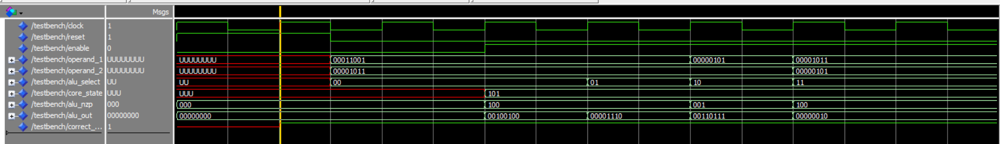
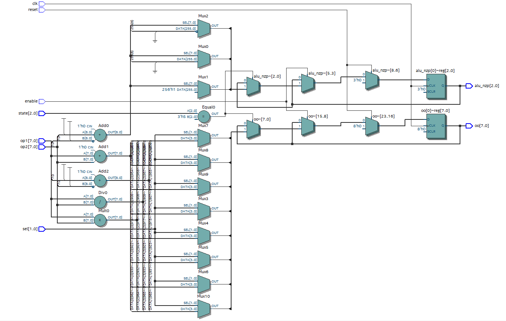
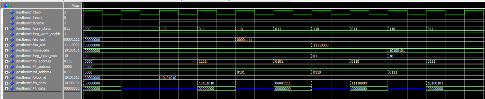
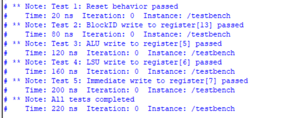
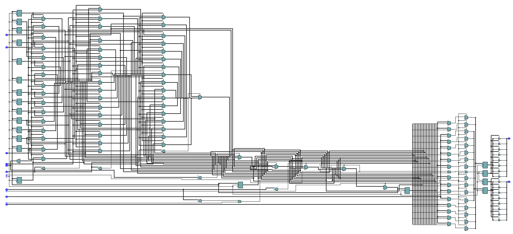
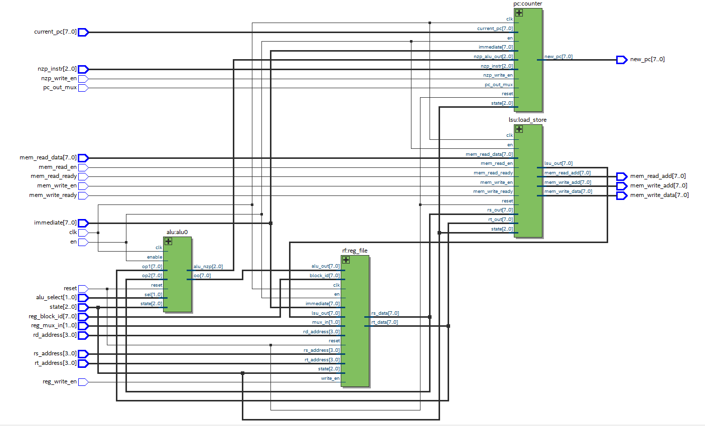
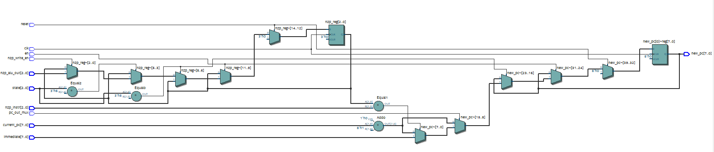
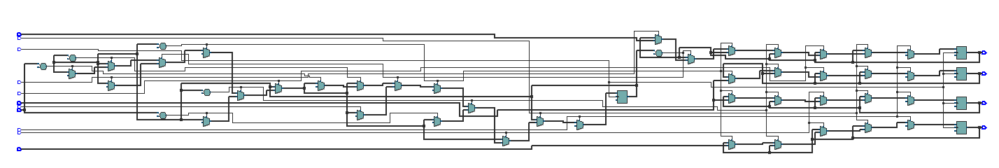

# Week 1
Week 1 consisted of learning the basics of VHDL and an introduction to digital design, as well as installation of Quartus for simulation.

# Week 2
Implemented the following combinational components as well as their testbenches in VHDL:
- Full Adder
- Multiplexer
- Decoder

The testbench implemented took a text file input of the form
`INPUT OUTPUT` in each line (where `OUTPUT` is the expected output of the component to the input).

For example, the `inputs.txt` file read by the testbench for the Full Adder is as follows:
```
000 00
001 10
010 10
011 01
100 10
101 01
110 01
111 11
```
Where the input is A, B, C<sub>in</sub> and output is sum, carry, in that order.

All implementations were successful, with no errors in the simulation as desired.

# Week 3
Went through the theory of process of addressing and implementing instruction sets, as well as single-cycle and multi-cycle datapaths.

# Week 4
Implemented ALU and Register File (Sequential Components) and tested them using the testbenches provided by the mentor (with a few tweaks).

The explanation for the waveform produced on running the testbench is as follows.

## ALU Simulation
Here is the simulation process code of the testbench `alu_tb.vhd` (Note that one clock cycle is of 20ns, and `enable` is initialized to 0):
```	
test_proc: process
begin
    -- Reset Behaviour
    reset <= '1';
    wait for 20 ns;
    if (alu_nzp = "000" and alu_out = "00000000") then
        correct_behavior <= '1';
    else 
        correct_behavior <= '0';
    end if;

    wait for 10 ns;
    reset <= '0';
    operand_1 <= "00011001";
    operand_2 <= "00001011";
    alu_select <= "00";
    wait for 30 ns;
    -- Nothing Changes since enable is 0

    -- Test 1
    enable <= '1';
    core_state <= "101";
    operand_1 <= "00011001";
    operand_2 <= "00001011";
    alu_select <= "00";
    wait for 20 ns;
    if(alu_out = "00100100" and alu_nzp = "100") then
        correct_behavior <= '1';
    else 
        correct_behavior <= '0';
    end if;

    -- Test 2
    alu_select <= "01";
    wait for 20 ns;
    if(alu_out = "00001110" and alu_nzp = "100") then
        correct_behavior <= '1';
    else 
        correct_behavior <= '0';
    end if;

    -- Test 3
    operand_1 <= "00000101";
    operand_2 <= "00001011";
    alu_select <= "10";
    wait for 20 ns;
    if(alu_out = "00110111" and alu_nzp = "001") then
        correct_behavior <= '1';
    else 
        correct_behavior <= '0';
    end if;

    -- Test 4
    operand_1 <= "00001011";
    operand_2 <= "00000101";
    alu_select <= "11";
    wait for 20 ns;
    if(alu_out = "00000010" and alu_nzp = "100") then
        correct_behavior <= '1';
    else 
        correct_behavior <= '0';
    end if;

    wait;
end process;
```



Above is the waveform generated on testing the ALU instance. As expected, `correct_behavior` is unintialized for the first clock cycle (when reset is pulsed), and is 1 otherwise, indicating that the ALU is correctly implemented.

The following is the RTL Netlist of the implemented ALU for verification.


## Register File Simulation
Here is the simulation process code of the testbench `rf_tb.vhd` (Again, one clock cycle lasts 20ns)

```
stim_proc: process
begin
-- 1. Reset Test
reset <= '1'; wait for clk_period;
    
-- Check reset behavior
if rs_data = ("00000000") and rt_data = ("00000000") then
    report "Test 1: Reset behavior passed" severity note;
else
    report "Test 1: Reset behavior failed" severity error;
end if;
    
reset <= '0'; wait for clk_period;


-- 2. BlockID Write Test
enable <= '1';
reg_write_enable <= '1';
    core_state <= "110";
block_id <= "10101010";  -- Writing to register 13 internally
wait for clk_period;

rs_address <= "1101";  -- 13
core_state <= "011";  -- ReadFromRF
wait for clk_period;

if rs_data = "10101010" then
    report "Test 2: BlockID write to register[13] passed" severity note;
else
    report "Test 2: BlockID write failed" severity error;
end if;

-- 3. ALU write test
core_state <= "110"; -- WriteToRF
rd_address <= "0101"; -- 5
alu_out <= "00001111";
reg_input_mux <= "00"; -- ALU path
wait for clk_period;

rs_address <= "0101";
core_state <= "011";
wait for clk_period;

if rs_data = "00001111" then
    report "Test 3: ALU write to register[5] passed" severity note;
else
    report "Test 3: ALU write failed" severity error;
end if;

-- 4. LSU write test
core_state <= "110";
rd_address <= "0110";
lsu_out <= "11110000";
reg_input_mux <= "01"; -- LSU path
wait for clk_period;

rs_address <= "0110";
core_state <= "011";
wait for clk_period;

if rs_data = "11110000" then
    report "Test 4: LSU write to register[6] passed" severity note;
else
    report "Test 4: LSU write failed" severity error;
end if;

-- 5. Immediate write test
core_state <= "110";
rd_address <= "0111";
immediate <= "10100101";
reg_input_mux <= "10"; -- IMM path
wait for clk_period;

rs_address <= "0111";
core_state <= "011";
wait for clk_period;

if rs_data = "10100101" then
    report "Test 5: Immediate write to register[7] passed" severity note;
else
    report "Test 5: Immediate write failed" severity error;
end if;

wait for 20 ns;
report "All tests completed" severity note;
wait;
end process;
```

Also, the initializations of the signals are as follows
```
signal clock           : std_logic := '0';
signal reset           : std_logic := '0';
signal enable          : std_logic := '0';
signal core_state      : std_logic_vector(2 downto 0) := (others => '0');
signal reg_write_enable: std_logic := '0';
signal alu_out         : std_logic_vector(7 downto 0) := (others => '0');
signal lsu_out         : std_logic_vector(7 downto 0) := (others => '0');
signal immediate       : std_logic_vector(7 downto 0) := (others => '0');
signal reg_input_mux   : std_logic_vector(1 downto 0) := (others => '0');
signal rs_address      : std_logic_vector(3 downto 0) := (others => '0');
signal rt_address      : std_logic_vector(3 downto 0) := (others => '0');
signal rd_address      : std_logic_vector(3 downto 0) := (others => '0');
signal block_id        : std_logic_vector(7 downto 0) := (others => '0');
signal rs_data         : std_logic_vector(7 downto 0);
signal rt_data         : std_logic_vector(7 downto 0);

constant clk_period : time := 20 ns;
```

Here is the waveform output and console output on running the simulation:

(The blue lines in the output indicate high impedance output. When the `core_state` is not 011, the output is high impedance because reading cannot be performed).


The following is the RTL Netlist of the implemented Register File for verification.


Note that in the implementation of the register file, it is not required for `reg_write_enable` to be 1 for reading the register file.

# Week 5
Implemented a **thread** using the components made in Week 4 as well as new components, namely, the LSU and Program Counter. Assembled all components to form a thread.

The RTL Netlist of the thread is as follows:


## The Program Counter (PC)
It outputs the memory address of the next instruction to be executed, given the current address, depending on the condition `pc_out_mux = '1' and nzp_instr = nzp_reg` when core state is 101 and where `nzp_reg` is the register which stores the 3-bit value `nzp_alu_out` from the ALU and updates whenever the system is at core state 110.

Following is the RTL Netlist of the Program Counter:


## Load Store Unit (LSU)
The LSU works as a finite state machine and it decides whether to load from or store into the memory based on several conditions. 

Following is the RTL Netlist of the LSU:
